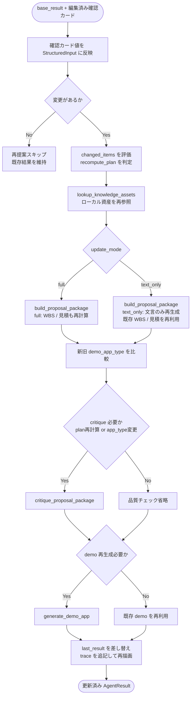

# AIエージェント設計方針と処理フロー

このドキュメントは、`README.md` では伝えきれない内部設計の考え方と処理の流れだけを整理したものです。
使い方やセットアップではなく、「どういう思想で、どの順で、どこを分岐しながら動くか」に絞って記載します。

## 設計方針

### 1. 固定主工程 + 判断分岐のハイブリッド

このエージェントは、完全自由探索型ではなく、主工程を固定したうえで必要なところだけ補助アクションを差し込む構成です。

- 主工程は `extract -> knowledge -> solution -> proposal -> critique -> demo`
- 各主工程の直後に Planner が「このまま進むか」「補助アクションを1回だけ挟むか」を判断
- 補助アクション実行後は再評価を1回だけ行う `bounded loop` とし、無限ループを防止

狙いは、実務で必要な再現性を維持しながら、入力品質の揺れにだけ適応性を持たせることです。

### 2. Human-in-the-loop 前提

曖昧さを無理に消し込まず、次の3種類に分けて扱います。

- `Ask`: 顧客に確認しないと確定できない事項
- `Assume`: 仮置きで先に進める事項
- `Confirmation Card`: ユーザーがあとから UI 上で補正できる項目

初回生成で全部を確定させるのではなく、人が確認カードを調整して `再提案` できる設計です。

### 3. ローカル資産優先

提案生成の土台は、外部システムよりもリポジトリ内の資産を優先して参照します。

- `knowledge/`:
  - 単価表(`knowledge/rate_card.json`)
  - リスクカタログ(`knowledge/risk_catalog.json`)
  - 過去案件(`knowledge/past_cases.json`)
- `templates/`:
  - 提案 HTML テンプレート(`templates/proposal_template.html`)
  - 標準 WBS(`templates/standard_wbs.json`)

これにより、毎回ゼロから生成するのではなく、組織内の標準に寄せた提案を作りやすくしています。

### 4. 段階的フォールバック

OpenAI API を使える場合は抽出・判断・批評・技術調査に活用し、失敗時はローカル処理へフォールバックします。

- 抽出失敗時: ルールベース抽出へフォールバック
- Planner 失敗時: 決定論的な判定へフォールバック
- 技術調査失敗時: 過去案件ベースのローカル文脈へフォールバック
- 品質チェック失敗時: ローカル整合性チェックを維持

「止まらないこと」を優先する設計です。

### 5. 再提案はフル再実行ではなく差分再生成

`再提案` は `AgentLoop.run()` を最初からやり直すのではなく、確認カードの変更影響だけを再計算する軽量更新です。

- 入力解析はやり直さない
- Planner の補助分岐も通さない
- 変更が文言だけに留まる場合は `WBS / 見積` を再利用
- スコープや方式に影響する変更だけ `WBS / 見積 / 品質チェック / デモ` を再評価

これにより、手戻りを減らしつつ、対話的に提案を磨けます。

## 主要な状態オブジェクト

| 状態 | 役割 |
| --- | --- |
| `StructuredInput` | 議事録/RFP を構造化した結果。課題、要件、制約、`Ask`、`Assume`、確認カードを保持 |
| `knowledge` | 単価表、標準 WBS、提案テンプレート、過去案件などのローカル知識 |
| `KnowledgeReference` | 提案時に参照した知識の出典メタデータ |
| `SolutionContext` | 過去案件知見と Web 検索結果を統合した技術検討コンテキスト |
| `ProposalPackage` | 提案 HTML、要約、WBS、見積、次回確認事項、デモ種別を束ねた成果物 |
| `DemoAppArtifact` | 生成された簡易デモアプリ |
| `TraceLog` | 各工程、Planner 判断、観測結果を記録するトレース |

## 初回生成フロー

初回生成は `AgentLoop` の固定シーケンスで進みます。LangGraph 風に見ると、主ノードは固定で、Planner が一部ノード間に条件分岐を差し込む形です。

```mermaid
flowchart TD
    Start([ユーザー入力])
    Extract["extract_presales_input<br/>議事録 / RFP -> StructuredInput"]
    P1{"Planner review<br/>補足調査が必要か"}
    Research["research_context<br/>extracted_facts を補完"]
    P1R["re-review<br/>再評価して continue のみ返す"]
    Lookup["lookup_knowledge_assets<br/>単価表 / 標準WBS / 過去案件 / テンプレート参照"]
    P2{"Planner review<br/>Assume 補完が必要か"}
    Augment["augment_assumptions<br/>ナレッジギャップから Assume を補完"]
    P2R["re-review<br/>再評価して continue のみ返す"]
    Solution["research_solution_context<br/>過去案件知見 + Web検索を統合"]
    Build["build_proposal_package<br/>提案HTML / WBS / 見積 / 次回確認事項"]
    Critique["critique_proposal_package<br/>重大な不整合をチェック"]
    P3["Planner review<br/>品質チェック後の評価ログ記録のみ<br/>追加アクション分岐なし"]
    Demo["generate_demo_app<br/>提案に沿った Streamlit デモ生成"]
    Persist["persist_run<br/>trace / metadata / input_snapshot 保存"]
    Snapshot["save_ui_snapshot<br/>UI 再表示用 snapshot 保存"]
    End([AgentResult 返却])

    Start --> Extract
    Extract --> P1
    P1 -- continue --> Lookup
    P1 -- extra_action --> Research
    Research --> P1R
    P1R --> Lookup

    Lookup --> P2
    P2 -- continue --> Solution
    P2 -- extra_action --> Augment
    Augment --> P2R
    P2R --> Solution

    Solution --> Build
    Build --> Critique
    Critique --> P3
    P3 --> Demo
    Demo --> Persist
    Persist --> Snapshot
    Snapshot --> End
```

<!-- markdownlint-disable MD033 -->

<!-- markdownlint-enable MD033 -->

### 初回生成でのポイント

- Planner が補助アクションを差し込めるのは実質的に `extract_presales_input` 後と `lookup_knowledge_assets` 後
- `critique_proposal_package` 後にも Planner review は走るが、ここは GUI の判断ログ出力のための評価であり、追加アクション分岐はしない
- `research_solution_context` は、過去案件知見と必要に応じた Web 検索結果を統合して技術提案の根拠を作る
- `build_proposal_package` で提案 HTML だけでなく、WBS、概算見積、次回確認事項まで一括生成する
- `critique_proposal_package` は軽微な改善ではなく「重大な不整合」の検出に寄せている
- 最後に成果物だけでなく `trace`、入力スナップショット、UI 用 snapshot も保存する

## 初回生成の状態遷移イメージ

各ノードは次のように状態を育てていきます。

```text
Raw Input
  -> StructuredInput
  -> StructuredInput + knowledge + references
  -> StructuredInput + knowledge + SolutionContext
  -> ProposalPackage
  -> Checked ProposalPackage
  -> Checked ProposalPackage + DemoAppArtifact
  -> AgentResult + TraceLog + saved artifacts
```

## 再提案フロー

再提案は、初回生成後にユーザーが `Confirmation Card` を編集したときの差分更新フローです。LangGraph 風に見ると、初回グラフとは別の軽量サブグラフとして動きます。

<!-- markdownlint-disable MD033 -->

<!-- markdownlint-enable MD033 -->

### 再提案でのポイント

- 入力ファイルの再解析はせず、既存の `StructuredInput` に確認カードの値だけ反映する
- 変更がない場合は処理自体をスキップする
- `見積 / スコープ / 方式 / ユーザー数 / 運用主体` などに関わる変更は `recompute_plan=True` となり、`WBS / 見積` まで再計算する
- それ以外の変更は `text_only` で提案文言中心に再生成し、既存 `WBS / 見積` を再利用する
- `demo_app_type` が変わった場合は品質チェックとデモ再生成を行う
- `rag_chat` と `faq_search` は確認カード値を UI 表示に直接使うため、値変更時にデモ再生成しやすい

## 初回生成と再提案の違い

| 観点 | 初回生成 | 再提案 |
| --- | --- | --- |
| 開始点 | 生の議事録 / RFP | 既存の `AgentResult` + 更新済み確認カード |
| 入力解析 | 実行する | 実行しない |
| Planner | 実行する | 実行しない |
| 技術調査 | 実行する | 実行しない |
| ナレッジ参照 | 実行する | 実行する |
| WBS / 見積 | 常に生成 | 変更影響が大きいときだけ再計算 |
| デモ再生成 | 常に実行 | 必要時のみ実行 |
| 永続化 | trace / metadata / snapshot を保存 | 既存 run 文脈を引き継いで成果物を更新する軽量更新 |

## この構成にしている理由

- 毎回フル自律にすると、出力の安定性が落ちやすい
- 毎回フル再実行にすると、ユーザーの微修正に対して重い
- 逆に固定処理だけだと入力の粗さに弱い

そのため、この実装では次のバランスを狙っています。

- 骨格は固定して再現性を担保する
- 不足情報だけ Planner で補う
- 人の確認を確認カードに閉じ込める
- 再提案は差分更新にして操作感を軽くする

README には利用者向けの説明を置き、このドキュメントでは開発者向けに「なぜこの流れなのか」「どこが分岐するのか」を追いやすくする役割を持たせます。
